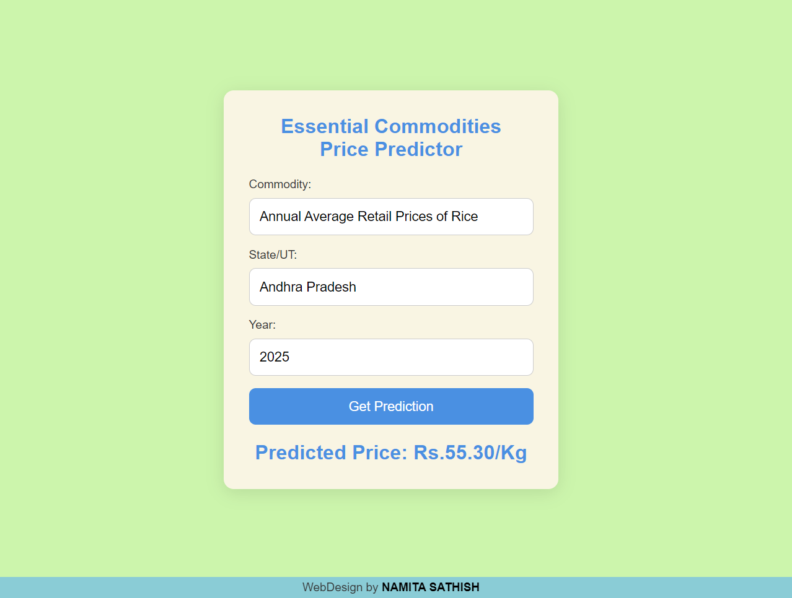

# Essential Commodity Price Prediction App
## Overview
This project predicts the future prices of essential food commodities (e.g., pulses, vegetables, etc.) based on historical data using a machine learning model. The prediction is done using an ARIMA model, and the project consists of:

- A ***Flask backend*** that processes the data and provides a prediction API.
- A ***React frontend*** that allows users to input the commodity name, location (State/UT), and the forecast year to get the predicted price.
- An ***ML model*** that predicts the prices of essential food commodities
  
## Features
Users can enter:
- Commodity name (e.g., Onion, Pulses, etc.)
- State/UT (e.g., Maharashtra, Tamil Nadu, etc.)
- Forecast year (Year in the future to forecast)
and the app predicts the price of the commodity for the given year based on historical data using an ARIMA model.

## ML model and Dataset 
- The Commodity Price Prediction Model is designed to forecast the future prices of essential food commodities in India using historical price data. It uses ARIMA model to capture trends from past years (2018–2023) and predict prices for upcoming years based on user input
- Dataset is from The Department of Consumer Affairs of India and contains annual average retail prices for various food commodities across Indian states and union territories from 2018 to 2023  
[https://www.data.gov.in/resource/stateut-wise-details-annual-average-retail-daily-prices-22-essential-food-commodities-2018](URL)

## Testing the Application
- Open the React frontend in your browser (http://localhost:3000).
- Enter the commodity name, state/UT, and forecast year in the form.
- Click "Get Prediction" to get the predicted price.
  
  ## Project Working

